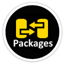

# Welcome to PackagesTransfer

**Interactive command-line to transfer packages between source to target with protocols Nuget and Npm.**

**Release Notes PackagesTransfer (V1.0.0)**

- GA acess

## License

This project is licensed under the [MIT License](https://github.com/FRACerqueira/PackagesTransfer/blob/master/LICENSE)
