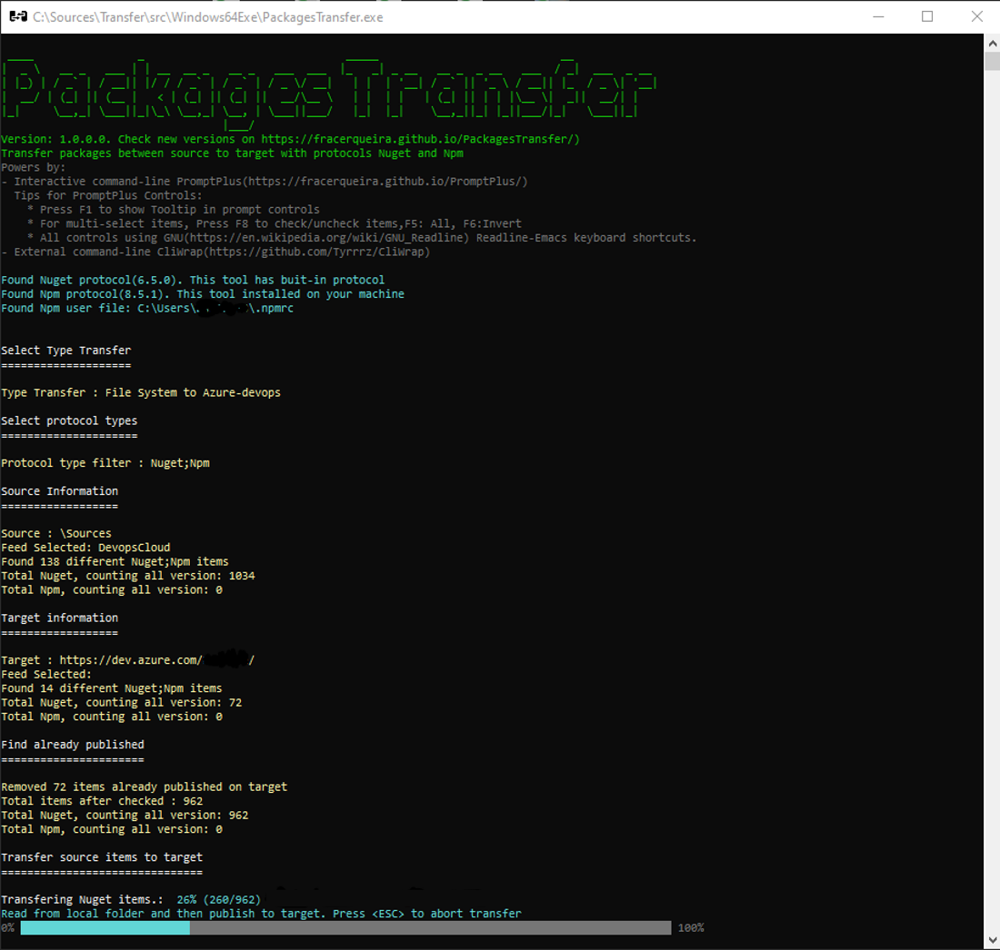

# Welcome to PackagesTransfer
[](https://github.com/FRACerqueira/PackagesTransfer/actions/workflows/build.yml)
[](https://github.com/FRACerqueira/PackagesTransfer/actions/workflows/publish.yml)
[](https://github.com/FRACerqueira/PackagesTransfer/blob/master/LICENSE)

**Interactive command-line to transfer packages between source to target with protocols Nuget and Npm.**

## Download V.1.0.0

- [Click here for Windows-X64 plataform](https://github.com/FRACerqueira/PackagesTransfer/releases/latest/download/Runtime-Windows64.zip) 
    - Extract the files in a folder and then run "./PackagesTransfer.exe" 

- [Click here for Linux-X64 plataform](https://github.com/FRACerqueira/PackagesTransfer/releases/latest/download/Runtime-Linux64.zip) 
    - Extract the files in a folder and then run "./PackagesTransfer" 

## Snapshot

### Exemple 1

### Exemple 2


## Features
[**Top**](#welcome-to-packagestransfer)

- Runs cross-platform (Windows/Linux)

- Verbose log to file (Folder Logs)

- Two types of protocols
    - NUGET (buit-in protocol)
    - NPM (must have the corresponding client version installed on your machine)

- Three types of transfer:
    - Between Azure-devops
    - File System to Azure-devops
    - Azure-devops to File System

- Option to skip packages by Upstream-Source

- Shows in advance the count of distinct and versioned packages by protocol type

- Pre-skip already existing packets at the destination

- When the origin is a file system, it allows up to 10 levels of search sub-folders

- Authentication with Azure-devops is performed with PAT (Personal Access Token)

- Display of a summary of successful and failed transfers

- All entries are saved (except passwords) in the usersettings.json file for the next run to be done in the "Next–Next–Finished" template

## Application configuration

Default settings are saved in the appsettings.json file

```csharp
{
  "DefaultSettings": {
    "showtips": false,
    "prefixurifeedsource": "feeds",
    "prefixurifeedtarget": "feeds",
    "prefixuripkgsource": "pkgs",
    "prefixuripkgtarget": "pkgs",
    "sourceuri": "https://",
    "targeturi": "https://",
    "pagelength": 10,
    "takequery": 50,
    "timeouthistorydays": 30,
    "timeoutcmd": 15000,
    "timeoutpush": 60000,
    "maxhistory": 5,
    "tmpfolder": "TransferTmp",
    "sufixnuget": ".nupkg;",
    "sufixnpm": ".tgz;.jar;"
  }
}
```

- showtips : default value to show/hide tooltips for controls
- prefixurifeedsource : default text for source azure-devops feed url prefix
- prefixurifeedtarget : default text for target azure-devops feed url prefix
- prefixuripkgsource : default text for source azure-devops package url prefix
- prefixuripkgtarget : default text for target azure-devops package url prefix
- sourceuri : default text for source azure-devops url 
- targeturi : default text for target azure-devops url
- pagelength : number of items per page for list controls
- takequery: maximum amount of items per query to azure-devops
- timeouthistorydays: timeout history for inputs, after timeout the item will be removed.
- timeoutcmd : timeout in milliseconds for executing local protocol commands
- timeoutpush: timeout in milliseconds to transfer package
- maxhistory : Maximum number of items in history. when reaching the maximum, the items will be rotated by the oldest.
- tmpfolder : default text for temporary transfer folder
- sufixnuget : default extensions of nuget protocol files. extensions are separated by semicolons
    - the first extension in the list will be used by default
- sufixnpm : default extensions of npm protocol files. extensions are separated by semicolons
    - the first extension in the list will be used by default

## Supported platforms
[**Top**](#welcome-to-packagestransfer)

- Windows
    - Command Prompt, PowerShell, Windows Terminal
- Linux (Ubuntu, etc)
    - Windows Terminal (WSL 2)

## Release Notes 
[**Top**](#welcome-to-packagestransfer)

**PackagesTransfer (V1.0.0)**

- GA access

## License
[**Top**](#welcome-to-packagestransfer)

This project is licensed under the [MIT License](https://github.com/FRACerqueira/PackagesTransfer/blob/master/LICENSE)
